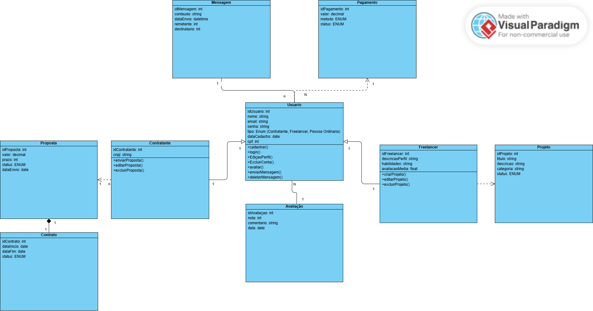
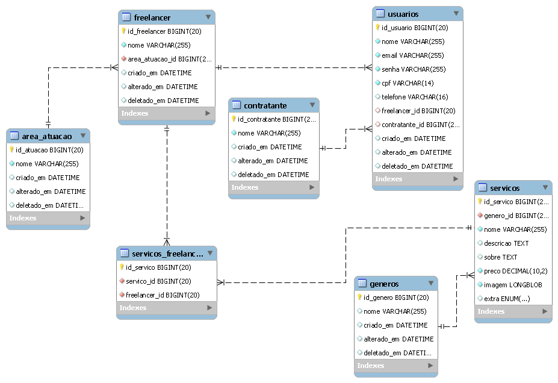
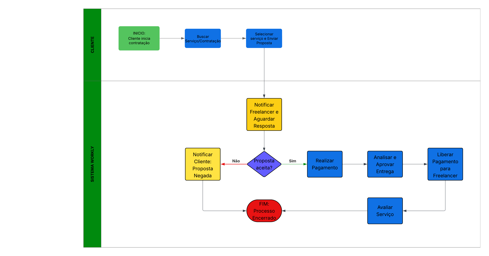
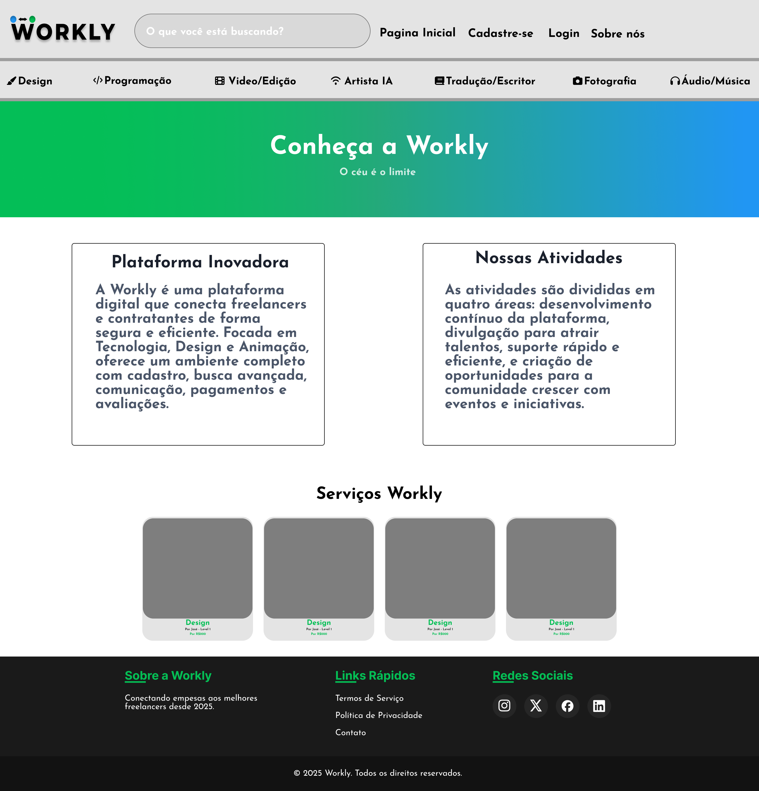

# 
### Plataforma digital que conecta freelancers e contratantes de forma segura e eficiente.

***

### Centro Paula Souza
### Faculdade de Tecnologia de Jahu
### Curso de Tecnologia em Desenvolvimento de Software Multiplataforma

### Documento da aplicação web

### **Workly**

### Jaú, SP

### 1º Semestre/2026

***

 

<strong>Sumário</strong>

 

- 
  - [🎯 Introdução](#-introdução)
    - [💡 Motivação](#-motivação)
    - [🎪 Objetivos](#-objetivos)
    - [📅 Cronograma](#-cronograma)
  - [📋 Documento de Requisitos](#-documento-de-requisitos)
    - [✅ Requisitos Funcionais](#-requisitos-funcionais)
      - [👤 **Cadastro, Acesso e Perfil**](#-cadastro-acesso-e-perfil)
      - [🔍 **Busca e Navegação**](#-busca-e-navegação)
      - [📦 **Criação e Contratação de Projetos**](#-criação-e-contratação-de-projetos)
      - [💬 **Comunicação e Contratos**](#-comunicação-e-contratos)
      - [💳 **Pagamentos, Depósitos e Saques**](#-pagamentos-depósitos-e-saques)
      - [⭐ **Avaliações e Feedbacks**](#-avaliações-e-feedbacks)
      - [📄 **Páginas Importantes**](#-páginas-importantes)
    - [⚙️ Requisitos Não Funcionais](#️-requisitos-não-funcionais)
  - [💼 Regras de Negócio](#-regras-de-negócio)
    - [🎯 O quê será elaborado](#-o-quê-será-elaborado)
    - [⚙️ Como será elaborado](#️-como-será-elaborado)
      - [**Parcerias Principais**](#parcerias-principais)
      - [**Atividades Principais**](#atividades-principais)
      - [**Recursos Principais**](#recursos-principais)
    - [👥 Para quem será elaborado?](#-para-quem-será-elaborado)
      - [🎯 **Segmento de Mercado**](#-segmento-de-mercado)
      - [**Relacionamento com Clientes**](#relacionamento-com-clientes)
      - [**Canais**](#canais)
    - [💰 Quanto custará?](#-quanto-custará)
      - [**Custo de Desenvolvimento**](#custo-de-desenvolvimento)
      - [**Custo de Infraestrutura**](#custo-de-infraestrutura)
      - [**Custo de Despesas Legais e Administrativas**](#custo-de-despesas-legais-e-administrativas)
      - [**Custo de Marketing**](#custo-de-marketing)
  - [📊 Estudo de Viabilidade](#-estudo-de-viabilidade)
    - [📈 Mercado](#-mercado)
    - [💵 Financeiro](#-financeiro)
    - [🔧 Técnica](#-técnica)
    - [🏢 Operacional](#-operacional)
  - [🎨 Diagramas da Aplicação](#-diagramas-da-aplicação)
    - [📊 Diagrama Lógico - Caso de Uso](#-diagrama-lógico---caso-de-uso)
    - [👥 Atores do Sistema](#-atores-do-sistema)
    - [🎭 Principais Casos de Uso](#-principais-casos-de-uso)
    - [🏗️ Diagrama de Classes](#️-diagrama-de-classes)
    - [🗄️ Diagrama Entidade-Relacionamento](#️-diagrama-entidade-relacionamento)
    - [🔄 Diagrama de Processo de Negócio (BPMN)](#-diagrama-de-processo-de-negócio-bpmn)
  - [🖌️ Design](#️-design)
    - [🎨 Paleta de Cores](#-paleta-de-cores)
    - [✍️ Tipografia](#️-tipografia)
    - [🏷️ Logo](#️-logo)
    - [🧭 Modelo de Navegação](#-modelo-de-navegação)
  - [🎭 Protótipo](#-protótipo)
  - [💻 Aplicação](#-aplicação)
  - [🏁 Considerações Finais](#-considerações-finais)
    - [1º Semestre](#1º-semestre)
    - [2º Semestre](#2º-semestre)
    - [3º Semestre](#3º-semestre)

 

## 🎯 Introdução
 
### 💡 Motivação
 
O mercado de trabalho brasileiro passa por uma **significativa transformação**, com crescimento notável tanto nas demissões voluntárias quanto no interesse por áreas de tecnologia. Esses movimentos revelam uma busca por novos modelos de trabalho que ofereçam maior autonomia e flexibilidade.
 
A **Workly** nasce da crescente insatisfação das pessoas com as condições tradicionais do mercado de trabalho, oferecendo uma alternativa mais **justa, flexível e alinhada às demandas do futuro**. A plataforma conecta talentos criativos e digitais a oportunidades reais, permitindo que cada profissional atue com autonomia, segurança e valorização do seu portfólio.
 
Ao intermediar de forma transparente e justa a relação entre contratantes e freelancers, a Workly não apenas amplia as possibilidades de carreira, mas também **transforma a frustração** com o modelo convencional em **oportunidades de crescimento, inovação e realização profissional**.

 

### 🎪 Objetivos
 
A Workly surge como resposta às transformações do mercado de trabalho contemporâneo, posicionando-se como uma **plataforma integradora** que conecta freelancers qualificados a oportunidades de projetos flexíveis. 
 
Nosso objetivo é desenvolver e consolidar uma plataforma digital inovadora que:
 
✨ Facilite conexões significativas entre profissionais independentes e contratantes da área de tecnologia  
🔒 Ofereça segurança, eficiência e ferramentas adequadas para ambos os lados  
📈 Amplie as possibilidades de carreira e crescimento profissional  
🌍 Transforme o mercado de trabalho em algo mais justo e flexível  

 

### 📅 Cronograma
 
📌 O cronograma completo do projeto está disponível em: **[Trello do Projeto](https://trello.com/b/WpYWgrs3/pi-site-de-freelancer)**
 

 

<a href="#inicio">[⬆️️ Voltar ao início]</a>

## 📋 Documento de Requisitos

Um **Documento de Requisitos de Sistema (DRS)** é um documento formal que descreve as funcionalidades e restrições de um sistema de software. Ele serve como um guia para a equipe de desenvolvimento. O DRS é essencial para garantir que todas as partes interessadas tenham uma compreensão clara do que o sistema deve fazer e como ele deve se comportar. Ele inclui requisitos funcionais, que descrevem as funcionalidades específicas do sistema, e requisitos não funcionais, que descrevem as qualidades do sistema, como desempenho, segurança e usabilidade.

 

### ✅ Requisitos Funcionais
 
Um **Documento de Requisitos de Sistema (DRS)** é um documento formal que descreve as funcionalidades e restrições de um sistema de software. Ele serve como um guia para a equipe de desenvolvimento.
 
#### 👤 **Cadastro, Acesso e Perfil**
- **RF 1** – Cadastrar usuário com informações básicas (Nome, E-mail e Senha)
- **RF 2** – Realizar login (Nome ou e-mail e senha)
- **RF 3** – Permitir criação e edição de perfis de freelancers e contratantes
#### 🔍 **Busca e Navegação**
- **RF 4** – Visualizar trabalhos públicos
- **RF 5** – Navegar por categorias (Design, Programação, Animação, etc.)
- **RF 6** – Sistema de pesquisa por palavras-chave
#### 📦 **Criação e Contratação de Projetos**
- **RF 7** – Solicitação, criação e personalização de propostas
- **RF 8** – Criar projetos para receberem propostas
- **RF 9** – Bloquear propostas indesejadas
- **RF 10** – Visualizar status da proposta (Aceita, Entregue, Negada)
#### 💬 **Comunicação e Contratos**
- **RF 11** – Comunicação direta via sistema interno (texto, imagens e documentos)
- **RF 12** – Notificação por e-mail e WhatsApp (com permissão do usuário)
- **RF 13** – Marcar projeto como entregue (confirmação de ambas as partes)
#### 💳 **Pagamentos, Depósitos e Saques**
- **RF 14** – Visualizar saldo e solicitar saques
- **RF 15** – Diferentes meios de saque e depósito (Cartão, PIX, etc.)
- **RF 16** – Limites de saque em diferentes horários para segurança
- **RF 17** – Visualizar histórico de transações
- **RF 18** – Permitir pagamentos dos projetos conforme contrato
#### ⭐ **Avaliações e Feedbacks**
- **RF 19** – Avaliação e exibição pública com comentários e nota
#### 📄 **Páginas Importantes**
- **RF 20** – Página "Sobre Nós"
- **RF 21** – Página de "Como Funciona" (para freelancers e clientes)
- **RF 22** – Termos de serviço e políticas de privacidade

 

### ⚙️ Requisitos Não Funcionais
 
| # | Requisito | Descrição |
|---|-----------|-----------|
| **RNF 1** | 🚀 Desempenho | Tempo de resposta otimizado e carregamento rápido |
| **RNF 2** | 🌐 Compatibilidade | Funciona em diferentes navegadores e dispositivos |
| **RNF 3** | ♿ Usabilidade | Interface intuitiva e acessível |
| **RNF 4** | 📈 Escalabilidade | Sistema preparado para crescimento |
| **RNF 5** | 🔧 Manutenibilidade | Código bem estruturado e documentado |
| **RNF 6** | 🔒 Segurança | Proteção de dados e transações seguras |

<a href="#inicio">[⬆️️ Voltar ao início]</a>

 

## 💼 Regras de Negócio

O Modelo de negócios da plataformase encontra abaixo:

 

### 🎯 O quê será elaborado

A Workly é uma plataforma digital inovadora que conecta freelancers e contratantes de forma segura e eficiente. Desenvolvida para atender às demandas do mercado de trabalho atual, a plataforma oferece um ambiente completo com ferramentas de cadastro, busca avançada, comunicação integrada, processamento de pagamentos e sistema de avaliações, abrangendo diversas áreas profissionais como Tecnologia, Design e Animação.

 

### ⚙️ Como será elaborado

#### **Parcerias Principais**
Para garantir que tudo funcione perfeitamente, contamos com parceiros importantes. Trabalhamos com empresas especializadas em pagamentos digitais para proteger seu dinheiro, serviços de comunicação para facilitar o contato entre usuários e instituições de ensino que nos ajudam a encontrar os melhores talentos. Essas parcerias nos permitem oferecer uma experiência completa e confiável para todos que usam nossa plataforma.

#### **Atividades Principais**
Nosso trabalho se divide em quatro áreas essenciais. Primeiro, cuidamos constantemente do desenvolvimento e melhorias da plataforma. Segundo, investimos em divulgação para atrair bons profissionais e clientes. Terceiro, oferecemos suporte rápido e eficiente para resolver qualquer dúvida. Por último, criamos oportunidades para a comunidade se conectar e crescer juntas através de eventos e iniciativas especiais.

#### **Recursos Principais**
Temos tudo o que precisamos para fazer a Workly dar certo: uma equipe dedicada, tecnologia de qualidade, sistemas seguros de pagamento e um banco de dados com perfis verificados. Esses recursos nos permitem manter a plataforma estável, segura e sempre evoluindo para atender melhor nossos usuários.

 

### 👥 Para quem será elaborado?

#### 🎯 **Segmento de Mercado**
- **Freelancers**: Profissionais de tecnologia em busca de projetos flexíveis
- **Contratantes**: Empresas e clientes que precisam de serviços especializados

#### **Relacionamento com Clientes**
Mantemos um relacionamento próximo com todos que usam nossa plataforma. Você pode contar com nosso suporte quando precisar, temos materiais para ajudar no autoatendimento, promovemos eventos para a comunidade se conhecer melhor e valorizamos muito o feedback de todos para continuarmos melhorando.

#### **Canais**
Estamos presentes onde nossos usuários estão: na nossa plataforma principal (site), nas redes sociais mais usadas pelo público e através das nossas parcerias com faculdades e empresas. Assim fica fácil encontrar e usar a Workly do jeito que preferir.

 

### 💰 Quanto custará?

O aplicativo terá como início com um conjunto de funcionalidades menor e na medida em que o número de usuarios e sua complexidade for aumentando maior será o valor de investimento a cada etapa, a princípio vamos considerar apenas um valor mínimo necessário para um primeiro lançamento da plataforma. Todos os custos abaixo se referem a valores na presente data deste documento.

#### **Custo de Desenvolvimento**
Por se tratar de uma plataforma criada para um fim acadêmico, não teremos nenhum custo com desenvolvimento, já que a própria equipe será encarregada dessa função de desenvolver os itens necessários para o bom funcionamento da Workly.

#### **Custo de Infraestrutura**

**Hospedagem**
Inicialmente serão utilizadas versões gratuitas de serviço em nuvem ou outros tipos de servidores para armazenamento do banco de dados dos usuários, mas posteriormente com a fonte de receitas dando renda serão aprimorados de acordo com a necessidade.

**Domínio e Certificado SSL**
Os domínios e a obtenção de um certificados SSL para o site atualmente são cotados por ano, e variam entre R$10,00 e R$100,00 reais ao ano, como ainda estamos em uma etapa de estimativas, vamos estimar o custo para a pior condição, portanto consideramos R$100,00 para uma implantação inicial por um período de um ano.

#### **Custo de Despesas Legais e Administrativas**
A princípio a plataforma não será registrada como uma empresa e sim apenas como um objeto de estudo acadêmico, portanto, não consideramos despesas legais e nem administrativas.

#### **Custo de Marketing**
Todo o lançamento e marketing serão realizados de maneira orgânica inicialmente, podendo escalar para tráfegos pagos dependendo do retorno das receitas e velocidade de escala da plataforma.

<a href="#inicio">[⬆️️ Voltar ao início]</a>

 

## 📊 Estudo de Viabilidade

### 📈 Mercado

O mercado de plataformas para freelancers no Brasil está em constante expansão, impulsionado pela crescente demanda por trabalho remoto e pela valorização de profissionais autônomos, especialmente nas áreas de tecnologia e design. Embora existam diversos sites semelhantes, a Workly se diferencia por oferecer uma experiência mais ampla e personalizada, com foco em cursos, capacitação e oportunidades voltadas para o público jovem e para empresas que buscam inovação.

 

### 💵 Financeiro

Será cobrado 10% do total que será pago na assinatura do freelancer ao ser contratado pelo preço a ser cobrado. Os anúncios e um plano premium serão também uma forma de aquisição monetária. Os gastos seriam hospedagem e anúncios de divulgação.

 

### 🔧 Técnica

Os requisitos serão cumpridos em apenas um computador para cada integrante do grupo, com a utilização de ferramentas gratuitas para o desenvolvimento do projeto, como o Visual Studio Code, Figma, Trello e GitHub. A hospedagem inicial será feita em plataformas gratuitas, como o GitHub Pages, que oferece serviços básicos sem custo. À medida que a plataforma cresce, podemos considerar opções pagas como AWS ou DigitalOcean para garantir maior estabilidade e recursos adicionais.

 

### 🏢 Operacional

A organização é perfeitamente capaz de executar o projeto e concluí-lo. Onde seria necessário 4 pessoas para seu feitio. Cada integrante do grupo teria uma função diferente, como front-end, back-end, designer e gerente de projeto. A comunicação seria feita por meio de reuniões semanais e o uso de ferramentas como Trello para gerenciamento de tarefas e GitHub para controle de versão do código. A colaboração eficaz entre os membros da equipe garantirá que o projeto seja concluído dentro do prazo e com alta qualidade.

 

<a href="#inicio">[⬆️️ Voltar ao início]</a>

## 🎨 Diagramas da Aplicação

 

### 📊 Diagrama Lógico - Caso de Uso

**Clique na imagem para ampliar** 🔍
 
 

### 👥 Atores do Sistema
 
| Ator | Descrição |
|------|-----------|
| **👤 Cliente** | Usuário que contrata serviços. Busca freelancers, contrata e avalia. |
| **🧑‍💻 Freelancer** | Profissional que oferece serviços. Cadastra e edita serviços. |
| **⚙️ Sistema** | Autenticação, armazenamento de dados e gerenciamento. |
| **👨‍💼 Administrador** | Gerencia usuários, remove serviços inapropriados, resolve disputas. |
 
 

### 🎭 Principais Casos de Uso
 

<strong>01 – Cadastrar Usuário</strong>

**Atores**: Cliente, Freelancer  
**Descrição**: Permite que novos usuários criem uma conta.
 
**Fluxo Principal**:
1. Usuário acessa a tela de cadastro
2. Informa nome, e-mail, senha e tipo de usuário
3. Sistema valida as informações
4. Sistema armazena os dados e confirma cadastro
**Fluxo Alternativo**:
- Se e-mail já estiver cadastrado → Sistema exibe mensagem de erro
**Pós-condição**: Conta criada com sucesso ✅
 

<strong>02 – Realizar Login</strong>

**Atores**: Cliente, Freelancer  
**Descrição**: Usuário acessa o sistema com credenciais.
 
**Fluxo Principal**:
1. Usuário informa e-mail e senha
2. Sistema valida as credenciais
3. Se válidas → Usuário redirecionado ao painel
**Fluxo Alternativo**:
- Se inválidas → Sistema informa erro ❌

<strong>03 – Criar Serviço</strong>

**Atores**: Freelancer  
**Descrição**: Freelancer cadastra um novo serviço.
 
**Fluxo Principal**:
1. Freelancer acessa o painel
2. Escolhe "Criar novo serviço"
3. Informa título, descrição, categoria, preço e prazo
4. Sistema salva e exibe na listagem
**Pós-condição**: Serviço disponível para visualização ✅
 

<strong>04 – Buscar e Visualizar Serviços</strong>

**Atores**: Cliente  
**Descrição**: Cliente pesquisa e visualiza serviços.
 
**Fluxo Principal**:
1. Cliente acessa página de busca
2. Informa termos (ex: "edição de vídeo")
3. Sistema lista serviços correspondentes
4. Cliente clica para ver detalhes e perfil

<strong>05 – Contratar Serviços</strong>

**Atores**: Cliente, Freelancer  
**Descrição**: Cliente contrata um serviço.
 
**Fluxo Principal**:
1. Cliente seleciona o serviço
2. Sistema exibe detalhes
3. Cliente confirma e realiza pagamento
4. Sistema notifica o freelancer
**Pós-condição**: Contrato criado entre partes ✅
 

<strong>06 – Avaliar Serviços</strong>

**Atores**: Cliente  
**Descrição**: Após conclusão, cliente avalia o serviço.
 
**Fluxo Principal**:
1. Cliente acessa histórico de serviços concluídos
2. Escolhe o serviço e adiciona nota e comentário
3. Sistema registra a avaliação
**Pós-condição**: Avaliação exibida no perfil do freelancer ⭐
 

<strong>07 – Gerenciar Perfil</strong>

**Atores**: Freelancer, Cliente  
**Descrição**: Permite alterar dados do perfil.
 
**Fluxo Principal**:
1. Usuário acessa painel de configurações
2. Altera informações (nome, descrição, foto, etc.)
3. Sistema salva as alterações

 

###  🏗️ Diagrama de Classes
 

**Clique na imagem para ampliar** 🔍
 
 

### 🗄️ Diagrama Entidade-Relacionamento
 

**Clique na imagem para ampliar** 🔍

 
 
### 🔄 Diagrama de Processo de Negócio (BPMN)
 

 **Clique na imagem para ampliar** 🔍

<a href="#inicio">⬆️️️ Voltar ao início</a>

 

## 🖌️ Design

### 🎨 Paleta de Cores

A paleta de cores da Workly foi selecionada para transmitir profissionalismo, confiança e modernidade. As cores principais e as utilizadas em detalhes, tela de fundo e como cor da fonte foram escolhidas para garantir uma identidade visual coesa e agradável, facilitando a usabilidade e a experiência do usuário.

**Clique na imagem para ampliar** 🔍

 

### ✍️ Tipografia

As fontes escolhidas foram selecionadas por sua **excelente legibilidade, versatilidade e elegância**:
 
| Fonte | Uso |
|-------|-----|
| **Montserrat** | Títulos, headings (Bold, Semi-bold) |
| **Josefin Sans** | Corpo de texto, descrições |
 
Elas contribuem para uma experiência de leitura agradável e reforçam a identidade visual profissional.

 

### 🏷️ Logo

O logotipo da Workly é um **isotipo** que utiliza vetores e a fonte Montserrat. Simboliza a **conexão eficiente e profissional** entre freelancers e clientes. Seu design foi concebido para transmitir a essência da plataforma de forma clara e memorável.

 

### 🧭 Modelo de Navegação

**Clique na imagem para ampliar** 🔍

<a href="#inicio">[⬆️️ Voltar ao início]</a>

 

## 🎭 Protótipo
 
O protótipo da Workly foi desenvolvido utilizando a ferramenta **Figma**, que permite a criação de interfaces interativas e visualmente atraentes.

> 🔗 **[Acesse o Protótipo no Figma](https://www.figma.com/design/hYmRgDqf9kCFHGjJNyExRh/Prot%C3%B3tipo-P.I?node-id=0-1&t=5eQE3HyoxGAMwKo0-0)**

 

## 💻 Aplicação
 
A aplicação foi desenvolvida inicialmente como uma **página estática**, incorporando exemplos de funcionalidades futuras e algumas já operacionais.
 
📁 **Arquivos e documentação** estão armazenados neste GitHub.

**Clique na imagem para ampliar** 🔍

 

## 🏁 Considerações Finais

### 1º Semestre
Este documento detalhou o processo de desenvolvimento da aplicação Workly. Durante o percurso, enfrentamos desafios, como a perda de um membro da equipe responsável pela documentação. No entanto, com a dedicação da equipe remanescente, conseguimos iniciar e avançar em diversas frentes, que serão concluídas no próximo semestre. Acreditamos que a Workly trará contribuições significativas para o mercado de trabalho, conectando freelancers e contratantes de forma eficiente e segura.

### 2º Semestre

Atualizamos toda a documentação, continuamos aprimorando a plataforma, implementando as funcionalidades planejadas tivemos dificuldade em concluir com o desenvolvimento da aplicação para seguir os requisitos desse semestre, mas conseguimos avançar em diversos aspectos do projeto, como o design, protótipo e documentação.

### 3º Semestre

**N/A**

<a href="#inicio">[⬆️️ Voltar ao início]</a>

